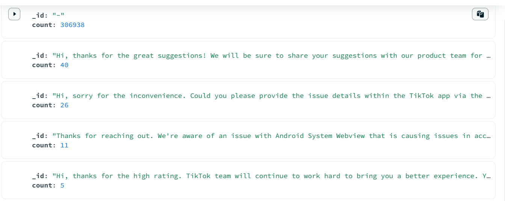
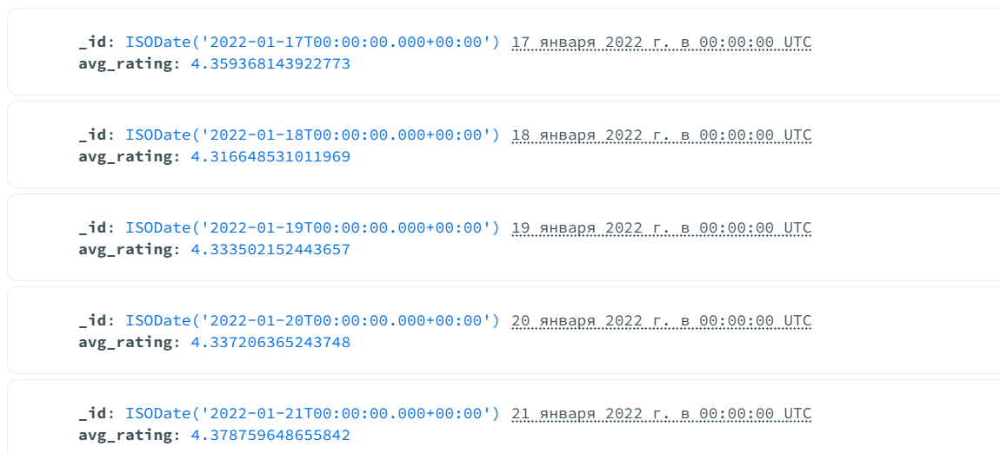

Top 5 frequently occurring comments
[
  { $group: { _id: "$replyContent", count: { $sum: 1 } } },
  { $sort: { count: -1 } },
  { $limit: 5 }
]

All entries where the “content” field is less than 5 characters long;

Average rating for each day (the result should be in timestamp type).
[
  {
    $match: {
      at: {
        $type: "date"
      }
    }
  },
  {
    $group:
      /**
       * _id: The id of the group.
       * fieldN: The first field name.
       */
      {
        _id: {
          $dateTrunc: {
            date: "$at",
            unit: "day"
          }
        },
        avg_rating: {
          $avg: "$score"
        }
      }
  },
  {
    $sort:
      /**
       * Provide any number of field/order pairs.
       */
      {
        _id: 1
      }
  }
]
